# Proyecto Coderhouse 🚀
 
El objetivo del proyecto es la carga de archivos y transformarlos para posteriormente insertarlos en una tabla en postgresql y en un bucket de AWS S3. Finalmente mostrar visualizaciones analizando los datos.
Como agregado se ag
 
# Datasets 📕
 
Informe mundial de la felicidad: Ranking mundial de la felicidad basado en distintos índices
```
https://www.kaggle.com/datasets/mathurinache/world-happiness-report
```
API Nominatim: API que te brinda la geolocalización de una dirección, localidad o país
```
https://nominatim.org/release-docs/latest/
```
 
# Arquitectura 👷‍♂️
 
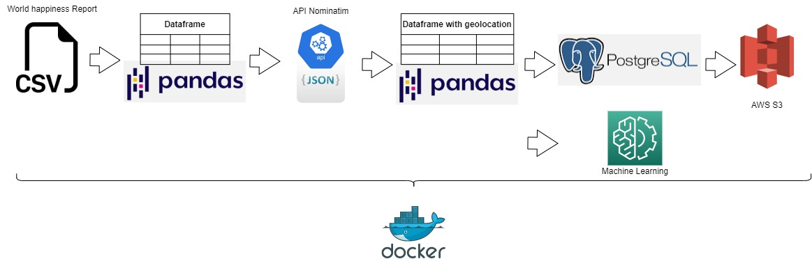
 
Estructura de archivos
 
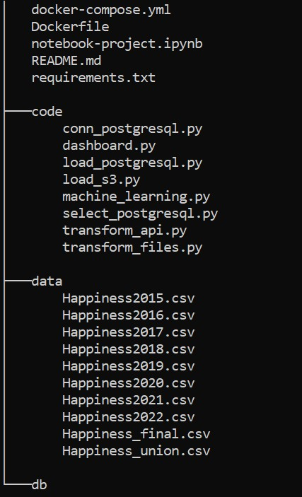
 
# Instalar y ejecutar 🔧
 
Primero se requiere crear un archivo .env con las siguientes variables para ejecutar `docker` con los servicios de python y postgresql
 
```
AWS_ACCESS_KEY=XXXXXXXXXXXXX
AWS_SECRET_KEY=XXXXXXXXXXXXXXXX
POSTGRES_USER=postgres
POSTGRES_PASSWORD=postgres
DB_PORT=5433
JUPYTER_ENABLE_LAB=yes
JUPYTER_TOKEN=coderhouse
```
Ejecutar docker
```
$ docker-compose up --build -d
```
Puedo validar que se están ejecutando con el siguiente comando
```
$ docker ps
```
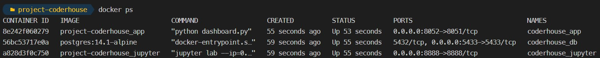
 
## Ingreso al bash para ejecutar cada archivo python por separado
```
$ docker exec -it coderhouse_app bash
```
 
## Tranformo los archivos csv de cada año y los uno en un solo dataset con algunas transformaciones en las columnas
```
$ python transform_files.py
```
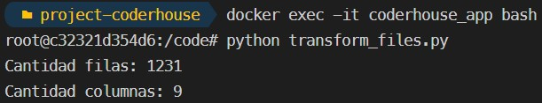
 
## Al archivo anterior, agrego el uso de la API Nominatim para agregar latitud y longitud de los diferentes paises
El proceso demora aproximadamente unos 15 min, el archivo Happiness_final.csv ya se encuentra dentro de /files
```
$ python transform_api.py
```
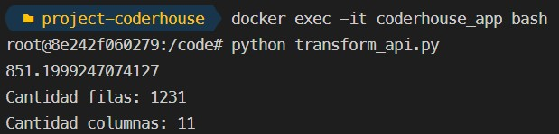
 
El proceso demora aproximadamente unos 15 min, el archivo Happiness_final.csv ya se encuentra dentro de /data
 
## Almaceno el dataset en la base de datos Postgresql, el servicio ya se encuentra corriendo
 
Válido que la conexión es correcta
```
$ python conn_postgresql.py
```
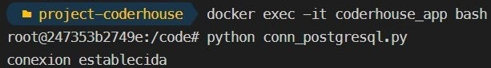
 
Cargo el dataset en la tabla happiness
```
$ python load_postgresql.py
```
 
Consulto la tabla y que contenga los datos cargados, en este caso solo muestro 10 registros
```
$ python select_postgresql.py
```
## Almaceno el dataset en AWS S3
 
```
$ python load_s3.py
```
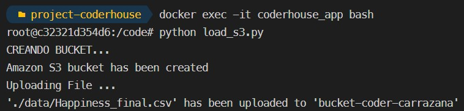
 
Desde la interfaz de AWS se ve de la siguiente manera
 
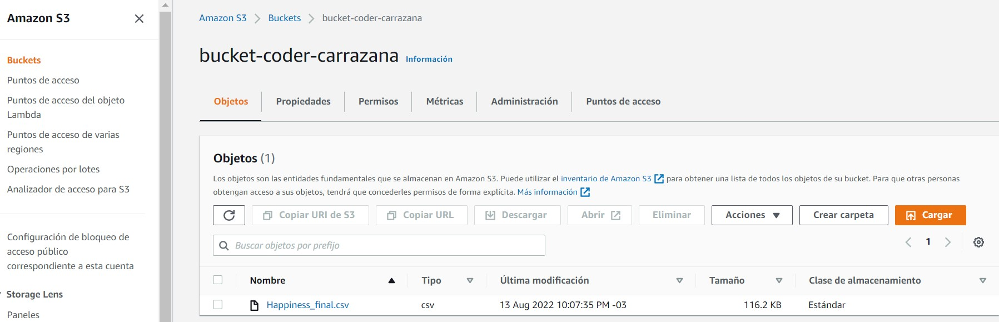
 
## Visualizaciones 📈
 
El archivo a ejecutar es el siguiente pero ya está corriendo
```
$ python dashboard.py
```
Se puede visualizar en su navegador
```
http://localhost:8052/
```
El primer gráfico es un mapa donde se muestra cada país con sus respectivo Score y también de esto depende el tamaño del punto
 
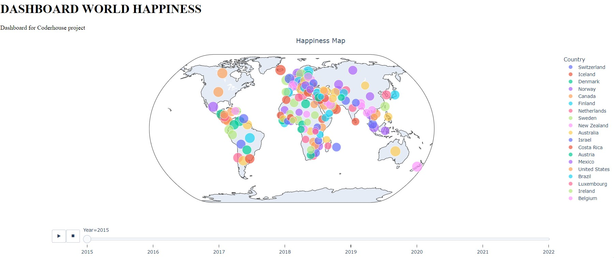
 
En el segundo gráfico es de líneas y se observa los distintos índices, y se puede filtrar por cada país
 
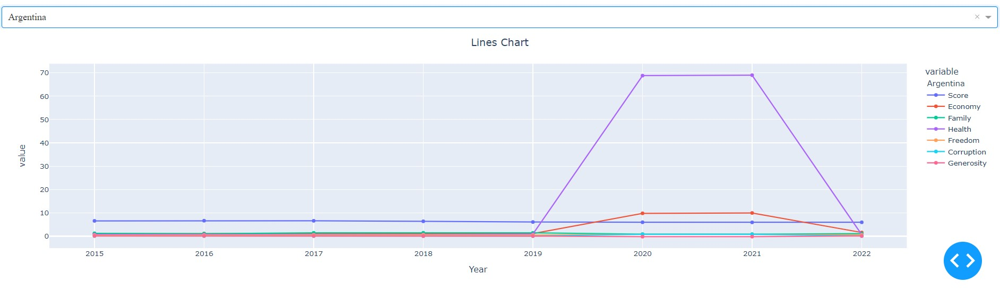
 
## Machine Learning
 
Se corrieron dos modelos LinearRegression y GradientBoostingRegressor, donde el segundo fue el que mejor funcionó dándome un Score más alto en la predicción
```
$ python machine_learning.py
```
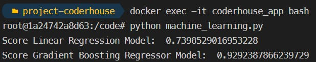

## Jupyterlab
 
Si se desea correr el notebook, esta corriendo jupyterlab en el siguiente puerto y el token:coderhouse
```
http://localhost:8888/
```
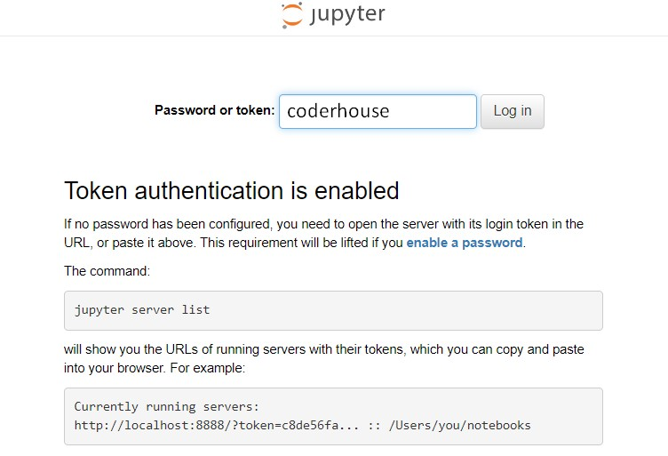

## Si se desea se puede entrar al contenedor de la base de datos postgress y validar la tabla
 
```
$ docker exec -it coderhouse_db bash
```
Comando para consultar por la tabla cargada y ver 10 registros
```
$ psql -d postgresql://${POSTGRES_USER}:${POSTGRES_PASSWORD}@db:${DB_PORT}/database -c "select * from happiness limit 10"
```

 
# Conclusión ✒️

Con respecto a lo que fue el dataset, mi hipotesis se confirmo en el analisis y posteriormente en las visualizaciones ya que los paises con un Score de felicidad mas alto son paises europeos, de America del Norte y en Oceanía. Otro punto que me llamo la atencíon fue que un pais potencia como China presento indices bajos.  
El trabajo me llevó a aprender a interactuar con el proceso de ingesta de un archivo .csv en una base de datos y servicio de AWS, después con el agregado de la arquitectura poder llevar esto a Docker y que se pueda ejecutar independientemente del sistema operativo.
Lo que es el modelo de machine learning también fue un aprendizaje.

